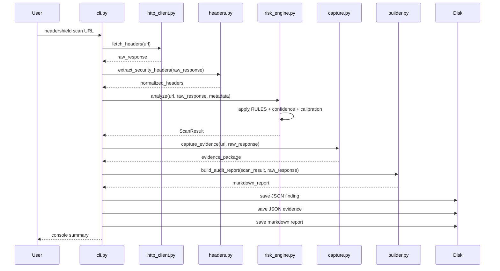
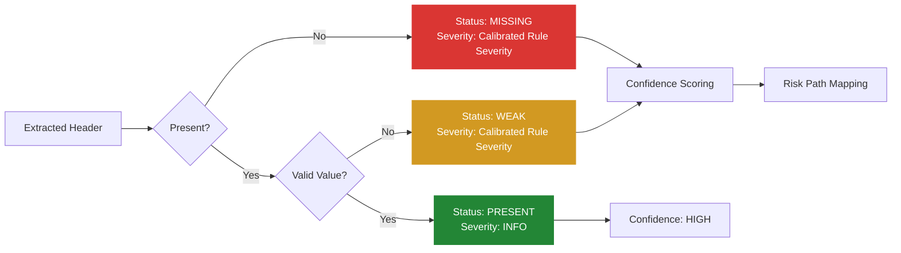

# HeaderShield Architecture

## System Overview

HeaderShield v2.1 is a modular security header audit engine built on a **separation of trust layers**:

- **Scanner** extracts raw data
- **Analyzer** applies judgment
- **Evidence** captures reproducibility
- **Report** packages trust

This design produces consistent, audit-grade output that scales from single URLs to batch operations.

---

## Component Architecture

```mermaid
flowchart TD
    A[CLI Entry<br/>cli.py] --> B{Command Router}

    B -->|scan| C[Single Scan Orchestrator]
    B -->|batch| D[Batch Scan Orchestrator]

    C --> E[HTTP Client<br/>scanner/http_client.py]
    D --> E

    E --> F[Raw Response]
    F --> G[Header Extractor<br/>scanner/headers.py]
    G --> H[Normalized Headers]

    H --> I[Risk Engine<br/>analyzer/risk_engine.py]
    I --> J[Header Rules<br/>analyzer/header_rules.py]
    J --> K[Findings]

    K --> L[Scan Result<br/>core/models/scan_result.py]

    E --> M[Evidence Capture<br/>evidence/capture.py]
    M --> N[Evidence Package]

    L --> O[Report Builder<br/>reports/builder.py]
    N --> O
    O --> P[Markdown Audit Report]

    L --> Q[JSON Finding]
    N --> R[JSON Evidence]

    Q --> S[(outputs/findings/)]
    R --> S
    P --> T[(outputs/reports/)]

    style A fill:#161b22,stroke:#58a6ff
    style E fill:#161b22,stroke:#238636
    style I fill:#161b22,stroke:#d29922
    style M fill:#161b22,stroke:#a371f7
    style O fill:#161b22,stroke:#58a6ff
```



---

## Data Flow



---

## Layer Responsibilities

### Core Layer (`core/`)

| Module | Purpose |
|---|---|
| `models/finding.py` | Immutable domain object for a single security finding |
| `models/scan_result.py` | Aggregate result with deterministic scoring |
| `enums/severity.py` | P0–P3 severity classification |
| `enums/status.py` | Finding status: missing / weak / present |

### Scanner Layer (`scanner/`)

| Module | Purpose |
|---|---|
| `http_client.py` | Raw HTTP fetch with redirect chain capture. No security logic. |
| `headers.py` | Extract security-relevant headers from merged redirect chain |

**Key design decision:** The scanner captures the full redirect chain and merges headers with sticky rules:

- HSTS is sticky: captured from any hop
- CSP is final-response only
- Other headers: final response wins

This prevents false negatives on modern architectures.

### Analyzer Layer (`analyzer/`)

| Module | Purpose |
|---|---|
| `header_rules.py` | Source of truth: rules, severity, risk paths, checks |
| `risk_engine.py` | Applies judgment, confidence scoring, severity calibration |

**Confidence scoring logic:**

```
HIGH   → No redirects, clear present/absent
MEDIUM → Redirects detected, ambiguous value, or missing after redirects
LOW    → Scan error, SSL failure, incomplete response
```

**Severity calibration:**

```
If confidence == LOW: downgrade 1 level
If redirects > 0 and severity in (P0, P1): downgrade 1 level
Never upgrade severity
```

### Evidence Layer (`evidence/`)

| Module | Purpose |
|---|---|
| `capture.py` | Raw response capture, reproducibility artifacts |
| `store.py` | Persistent storage for findings and evidence |

Every scan produces:
- Full raw headers
- Merged headers
- Redirect chain
- Reproducible curl command
- Timestamp

### Report Layer (`reports/`)

| Module | Purpose |
|---|---|
| `builder.py` | Transforms ScanResult into markdown audit report |
| `templates/audit_v1.md` | Report template structure |

Reports include:
- Executive summary with redirect awareness
- Per-finding detail with confidence levels
- Redirect chain table (if applicable)
- Active risk paths
- Copy-paste remediation
- Evidence and reproducibility curl command

---

## Header Evaluation Logic



---

## Risk Path Mapping

Each rule defines:

- **Severity**: P0 (Critical) → P3 (Low)
- **Risk Path**: Specific attack scenario enabled by the gap
- **Validation**: Function determining if header value meets baseline
- **Remediation**: Copy-paste ready fix

Example:

```
Content-Security-Policy
├── Missing → P0 → XSS injection surface possible
├── Weak policy → P0 → XSS injection surface possible
└── Correct → INFO → No risk paths
```

After calibration with confidence:

```
Content-Security-Policy (missing, redirects detected)
├── Raw severity: P0
├── Confidence: MEDIUM
├── Calibrated: P1
└── Evidence: "not found in final response; 2 redirects detected; may exist on intermediate hop"
```

---

## Output Pipeline

```mermaid
flowchart TD
    A[ScanResult + RawResponse] --> B[Finding List]
    A --> C[Risk Summary]
    A --> D[Evidence Package]

    B --> E[Per-Header Detail]
    E --> F[Status + Severity + Confidence]
    E --> G[Current / Expected Value]
    E --> H[Evidence]
    E --> I[Remediation]

    C --> J[Issue Counts by Severity]
    C --> K[Active Risk Paths]
    C --> L[Severity Score]

    D --> M[Raw Headers]
    D --> N[Redirect Chain]
    D --> O[Reproducible curl]
    D --> P[Timestamp]

    B --> Q[JSON Output]
    C --> Q
    D --> R[JSON Evidence]
    B --> S[Markdown Report]
    C --> S
    D --> S

    style A fill:#161b22,stroke:#58a6ff
    style Q fill:#21262d,stroke:#30363d
    style S fill:#21262d,stroke:#30363d
```



---

## Design Principles

1. **Separation of Trust Layers** — Scanner extracts, analyzer judges, reporter packages. No mixed concerns.
2. **Passive Only** — No payload injection. Safe for production.
3. **Audit-Grade Output** — Every finding includes evidence, timestamp, and reproducibility.
4. **Deterministic Scoring** — Same input always produces same severity score.
5. **Dual Output** — Machine-readable JSON + human-readable Markdown for every scan.
6. **Modular** — Swap scanner engine, add rules, or replace report format without touching other layers.

---

## Extension Points

| Extension | How |
|---|---|
| New header check | Add rule to `analyzer/header_rules.py` |
| New risk path | Add to `RiskPath` enum, reference in rule |
| New report format | Add builder in `reports/`, wire in CLI |
| Config-driven rules | Load from `config/rules.yaml` instead of hardcoded |
| CI/CD integration | Use `scan` command, parse JSON output |
| Parallel batch scanning | Extend `cli.py` batch orchestrator |

---

## Testing Strategy

- **Unit tests**: Header rule validation, severity assignment, scoring logic
- **Integration tests**: Full scan pipeline against known-good and known-bad targets
- **Fixture tests**: Pre-recorded responses for offline, deterministic test runs

Test files: `tests/test_analyzer.py`

---

## Performance

| Metric | Value |
|---|---|
| Single scan time | ~1–3 seconds (network dependent) |
| Memory footprint | < 50 MB |
| Batch capacity | 500+ URLs per run |
| Output per target | ~5–15 KB JSON + ~10–30 KB Markdown |
| Rate limiting | Respects target response time; sequential in v2.1 |

---

## Real-World Validation

HeaderShield v2.1 was validated against `https://vercel.com` — a modern, well-hardened platform.

**Results:**
- 4 headers correctly configured (HSTS, CSP, X-Frame-Options, X-Content-Type-Options)
- 3 gaps found: Referrer-Policy (weak), Permissions-Policy (missing), Server (exposed)
- 0 false alarms
- 0 critical/high severity — calibrated correctly to medium/low

This demonstrates the tool's ability to find real issues without generating noise on hardened targets.

---

*Architecture version: 2.1.0*
